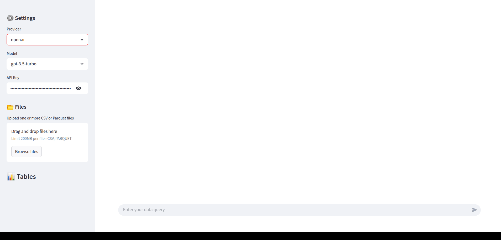

# DuckChat

DuckChat is an interactive data analysis application built with Streamlit that allows you to analyze your data using natural language. It leverages DuckDB for efficient data processing and supports multiple LLM providers (Ollama and OpenAI) to convert your natural language queries into SQL.



## Features

- 📊 **Data Upload**: Upload CSV or Parquet files with automatic table creation in DuckDB
- 🤖 **Natural Language Interface**: Query your data using plain Language
- 🔄 **Multiple LLM Support**: Choose between Ollama and OpenAI models
- 💬 **Interactive Chat**: Preview SQL queries before execution
- 🚀 **Fast Processing**: Powered by DuckDB for efficient data handling
- 🎯 **SQL Validation**: Automatic SQL syntax checking and validation

## Prerequisites

- Docker and Docker Compose
- For OpenAI support: OpenAI API key (optional)

## Quick Start

1. Clone the repository:
```bash
git clone https://github.com/yourusername/duckchat.git
cd duckchat
```

2. Start the application:
```bash
docker-compose up --build
```

3. Access the application at `http://localhost:8501`

## Model Setup

### Using Ollama (Example)
```bash
# Pull the SQLCoder model
docker exec -it ollama ollama pull sqlcoder:15b
```

### Using OpenAI (Optional)
1. Set your OpenAI API key in the `.env` file:
```
OPENAI_API_KEY=your_api_key_here
```

## Example Queries

Try these example prompts to get started with example data:
- "List 3 artists"
- "Which albums did AC/DC release?"
- "List all Rock genre songs from the album 'Let There Be Rock'."
- "Who composed the song 'Stairway To Heaven'?"
- "What is the total duration (in minutes and seconds) of the album 'IV' by Led Zeppelin?"


## Contributing

Contributions are welcome! Please feel free to submit a Pull Request.


## License

This project is licensed under the MIT License - see the [LICENSE](LICENSE) file for details.
